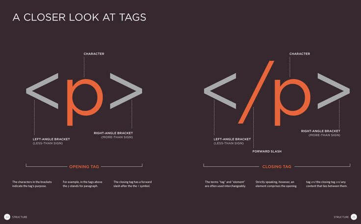

# A little bit about HTML,CSS AND JAVASCRIPT

 In this article i will be sharing what i know about Hypertext markup language, cascading style sheets and javascript, these three web design
or development languages are used by developers all around the world to develop and design websites that are used by people all around the world. 
I want people to be able to understand how the website they use on the daily basis are developed and the code that is running in the background
.

* Hyper text markup language -

 Html is the standard markup language for creating websites, it is the standard structure of a website that includes elements like paragraphs,
headings, links, buttons, and forms. The elements that are used in html tell the browser how the  website should be displayed with all its contents.
 Html elements label pieces of content such as "this is a heading", "this is a paragraph", "this is a link", etc. For the code to run the way you 
want it to work, remember to always put your code inside the opening and closing tags
.

* Cascading Style Sheeets - 

Css is the language used to style the html document, css describes how the html elements should be displayed. Separation of formatting and content 
 also makes it possible to present the same markup page in different styles for different rendering methods, such as on-screen, in print, by voice (via
 speech-based browser or screen reader), and on Braille-based tactile devices. CSS also has rules for alternate formatting if the content is accessed on
 a mobile device
.

* Javascript - 

JavaScript, often abbreviated as JS, is a programming language that conforms to the ECMAScript specification. JavaScript is high-level, often just-in-time 
compiled, and multi-paradigm. It has curly-bracket syntax, dynamic typing, prototype-based object-orientation, and first-class functions.

