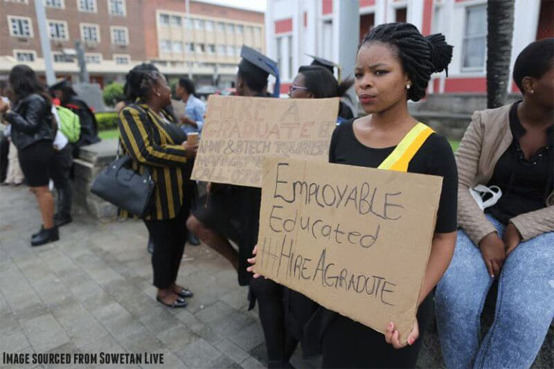

# Not having experience is locking doors for the youth.

We go to schools and study 7 years of primary and 5 years of high school, plus three to four years of university or college. Just to be asked if we have close to 5-10 years of experience when we look for work after we are done with our studies. I do not want to change people's attitude towards education.

But if education is the key to success, why should one have to struggle to get a job after finishing their studies? Personally, I feel like education is there to programme us and not prepare us for life after education. There are people out there in the country that have degrees, diplomas and phds but are struggling to get a job.

It is not like they are not trying to get employed but not having experience in the field of what they studied is the reason behind them sitting at home with their qualifications, others have 5 and counting years with the qualification but are unemployed. This affects the youth a lot and it is the reason why the rate of youth that is unemployed in South Africa is always high.

